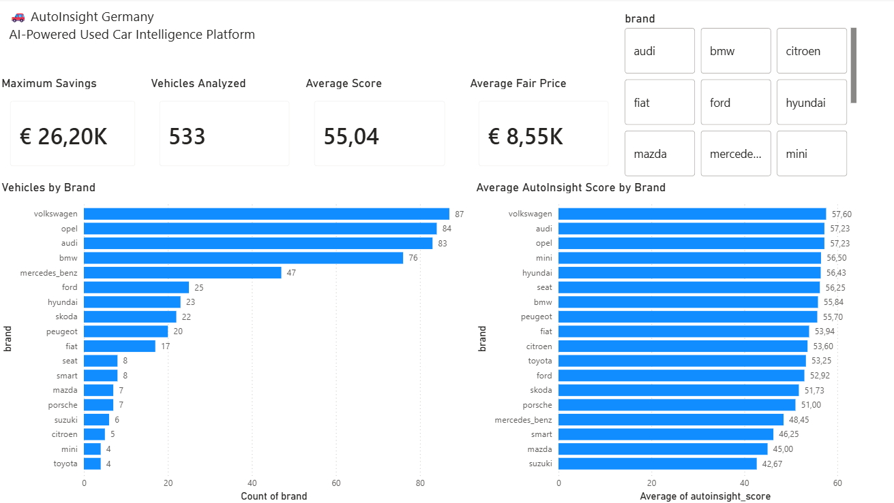
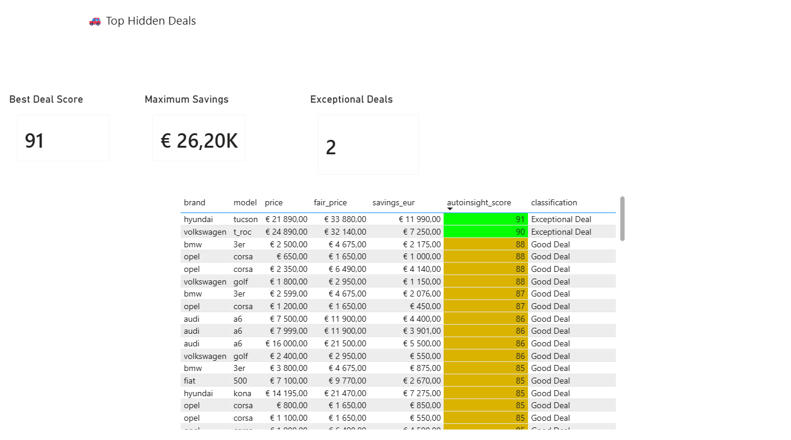
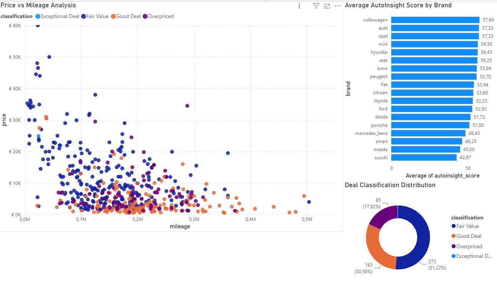

# AutoInsight Germany

AI-powered analytics platform for the German used car market.

## Project Overview

AutoInsight Germany is a data analytics project designed to identify undervalued vehicles in the German used car market. The platform collects vehicle listings, cleans and validates the data, estimates fair market values, and generates a proprietary AutoInsight Score to highlight potential buying opportunities.

The project demonstrates a complete analytics workflow including data collection, data cleaning, feature engineering, market segmentation, database analytics, and interactive dashboard development.

## Business Problem

Used car buyers often struggle to determine whether a vehicle is fairly priced. Market prices vary significantly depending on vehicle age, mileage, and model popularity, making it difficult to identify good opportunities.

This project addresses that challenge by benchmarking vehicles against comparable listings and estimating a fair market price for each vehicle.

---

## Project Statistics

| Metric | Value |
|----------|----------|
| Scraped Listings | 1,277 |
| Cleaned Vehicle Records | 1,196 |
| Benchmarkable Vehicles | 533 |
| Market Segments Created | 112 |
| Exceptional Deals Identified | 2 |
| Fair Price Engine Version | v2 |

---

## Methodology

### Data Collection

Vehicle listings were collected from Kleinanzeigen and processed through a custom ETL pipeline.

### Data Quality Challenge

Kleinanzeigen search results contained unrelated advertisements and non-vehicle listings.

### Solution

A data quality filtering and category validation process was implemented during the ETL stage to remove invalid records and improve dataset reliability.

### Fair Price Engine v2

Market price estimation is based on:

- Vehicle brand
- Vehicle model
- Vehicle age segment

Fair Price is calculated using the median market price of comparable vehicles within each market segment.

### AutoInsight Score

The proprietary AutoInsight Score evaluates each vehicle using:

- Market discount percentage
- Vehicle age
- Vehicle mileage
- Market liquidity
- Model popularity

Vehicle classifications:

- Exceptional Deal
- Good Deal
- Fair Value
- Overpriced

---

## Data Pipeline

1. Web scraping from Kleinanzeigen
2. Data cleaning and validation
3. PostgreSQL data storage
4. SQL analytics and feature engineering
5. Fair Price Engine calculation
6. AutoInsight Score generation
7. Power BI dashboard visualization

---

## Tech Stack

- Python
- Pandas
- BeautifulSoup
- PostgreSQL
- SQL
- Power BI
- Git
- GitHub

---

## Key Insights

- Volkswagen, Audi, and Opel were among the most represented brands in the dataset.
- Vehicle price generally decreases as mileage increases.
- Only a small percentage of vehicles qualified as Exceptional Deals.
- Most listings fell into the Fair Value and Good Deal categories.
- The AutoInsight Score successfully identified undervalued opportunities within the market.

---

## Dashboards

### Executive Overview



### Top Hidden Deals



### Market Intelligence



---

## Repository Structure

```text
AutoInsight-Germany/
│
├── data/
│   ├── raw/
│   └── processed/
│
├── src/
│   ├── scraping/
│   ├── cleaning/
│   └── analytics/
│
├── dashboard/
│   └── AutoInsight_Germany.pbix
│
├── images/
│   ├── dashboard_overview.png
│   ├── top_hidden_deals.png
│   └── market_intelligence.png
│
├── README.md
└── requirements.txt
```

---

## Future Improvements

- Machine Learning price prediction model
- Automated data refresh pipeline
- Real-time market monitoring
- Interactive web application
- Vehicle depreciation forecasting

---

## Author

**Oleksandr Yaresko**

Data Analytics Portfolio Project

GitHub Repository:
https://github.com/oleksandr-yaresko/AutoInsight-Germany